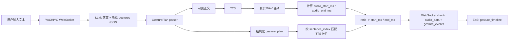
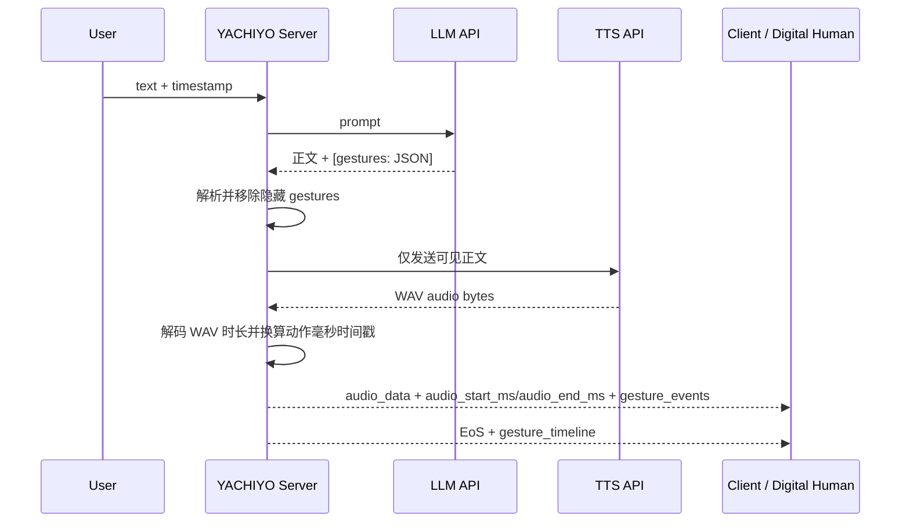
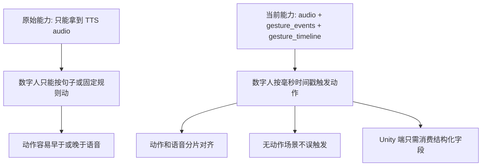

# Xiangyue Label 汇报材料

## 汇报话术

本次改动把原先“LLM 只输出回复文本/TTS 音频”的链路，扩展成了“文本、音频、动作时间戳”对齐输出。LLM 现在会在回复末尾生成一段隐藏的结构化动作计划 `[gestures: ...]`，服务端解析后会把这段隐藏内容从正文里剥离，保证用户和 TTS 只接收到正常聊天文本。TTS 每生成一段真实音频后，服务端会解码音频长度，用真实 WAV 时长把动作的 `start_ratio/end_ratio` 换算成毫秒级 `start_ms/end_ms`，并随 WebSocket chunk 输出 `gesture_events`，最后在 `EoS` 汇总输出完整 `gesture_timeline`。这样数字人端可以直接用音频和动作时间戳驱动动画，避免按整句粗糙触发导致的动作和语音错位。

## 端到端数据流



## 时序逻辑



## 代码改动

| 文件 | 改动 |
|---|---|
| `Modules/llm_utils/GesturePlan.py` | 新增隐藏 `[gestures: JSON]` 解析器，校验八类动作 ID、`sentence_index`、`start_ratio/end_ratio`，并剥离不可见标签。 |
| `Modules/llm_openai/OpenaiStep.py` | 新增 `gesture_plan_mode`。在该模式下先收集完整 LLM 流式回复，解析动作计划，再按原有 `StreamCutter` 分片输出可见文本和 `gesture_plan`。 |
| `Modules/tts_base/TTSStep.py` | 新增音频时间线。TTS 后解码真实 WAV 时长，输出 `audio_start_ms/audio_end_ms/audio_duration_ms`，并生成 chunk 级 `gesture_events` 和 EoS 级 `gesture_timeline`。 |
| `Modules/tts_openai/OpenaiTTSStep.py` | OpenAI TTS 路径接入音频时间线初始化。 |
| `configs/unity_chan_default.json` | 默认 Unity 配置透传 `sentence_index/gesture_plan` 到 TTS，并把输出扩展为音频时间线和动作事件。 |
| `configs/lorebooks/unity_chan.json` | Prompt 从 inline `[动作](表情)` 改为正文 + 隐藏 `[gestures: ...]`，并约束八类动作和空动作策略。 |
| `configs/datasets/unity_chan_motion_list.json` | 动作字典收敛到八类目标动作标签。 |
| `configs/yachiyo_animation_text_tts.json` | 新增文本输入到 LLM/TTS 的轻量测试配置，便于独立验证标签和时间戳链路。 |
| `deploy/mock_openai.py` | 新增 OpenAI-compatible deterministic 测试后端，用于复现实测结果。 |
| `test/test_dev_default_lorebook.py`, `test/test_prompt_compliance.py` | Prompt 合规测试的动作集合同步到八类目标动作。 |

## 输出协议

兼容性原则：新链路是增量输出，不替换旧字段。`gesture_plan_mode` 开启后，LLM 分片仍然保留旧 pipeline 使用的 `text/raw_text/action/expression` 字段，同时额外增加 `sentence_index/gesture_plan`。`unity_chan_default` 最后一跳也继续向客户端透传旧的 `action/action_hint/expression/expression_hint` 字段，并额外输出 `audio_start_ms/audio_end_ms/audio_duration_ms/gesture_events/gesture_timeline/audio_total_ms`。因此旧客户端可以继续读原字段，新数字人链路可以读新增时间戳字段。

单个音频 chunk 的输出结构：

```json
{
  "text": "我把步骤记下来。",
  "audio_data": "...base64 wav...",
  "audio_start_ms": 0,
  "audio_end_ms": 610,
  "audio_duration_ms": 610,
  "gesture_events": [
    {
      "action": "write",
      "label": "写字",
      "sentence_index": 0,
      "sentence_text": "我把步骤记下来。",
      "start_ms": 110,
      "end_ms": 500
    }
  ]
}
```

整轮结束时的汇总输出：

```json
{
  "signal": "EoS",
  "audio_total_ms": 1905,
  "gesture_timeline": [
    {
      "action": "write",
      "label": "写字",
      "start_ms": 110,
      "end_ms": 500
    }
  ]
}
```

## 正式验收结果

测试报告文件：

```text
/mnt/data/cpfs/haiyang/YACHIYO_server_test/test_outputs/gesture_e2e_contract_1781245778.json
```

测试信息：

| 项目 | 值 |
|---|---|
| run_id | `contract_1781245758_5989` |
| started_at | `2026-06-12T14:29:18+08:00` |
| finished_at | `2026-06-12T14:29:38+08:00` |
| server_http | `http://127.0.0.1:7000` |
| server_ws | `ws://127.0.0.1:7000` |
| model_config | `yachiyo_animation_text_tts` |
| result | `all_pass = true` |

说明：验收使用真实 YACHIYO `register -> init_pipeline -> WebSocket -> unregister` 生命周期，并解码返回的 `audio_data` 校验实际 WAV 时长。模型和 TTS 侧使用 OpenAI-compatible deterministic 测试端点，服务端解析、分片、TTS 调用、音频时长计算和动作时间戳输出链路均为真实执行。

| case | 结果 | chunk | audio_total_ms | 输出动作 | 动作时间戳 | 可见文本 |
|---|---|---:|---:|---|---|---|
| `left_scratch_head` | PASS | 2 | 1670 | `left_scratch_head` | `137-532ms` | 这个点我有点拿不准。先让我把条件重新捋一下。 |
| `left_cheek_on_hand` | PASS | 1 | 1285 | `left_cheek_on_hand` | `154-1002ms` | 嗯，我先听着。这个问题可以慢慢想。 |
| `flip_book` | PASS | 2 | 1445 | `flip_book` | `61-439ms` | 我去翻一下资料。找到对应记录再告诉你。 |
| `head_tilt` | PASS | 2 | 1595 | `head_tilt` | `167-551ms` | 诶，这个说法有点奇怪。你是指前一个版本吗？ |
| `write` | PASS | 3 | 1905 | `write` | `110-500ms` | 我把步骤记下来。第一步先确认输入，第二步再看输出。 |
| `nod` | PASS | 2 | 1520 | `nod` | `91-441ms` | 对，这样理解是对的。后面就按这个接口走。 |
| `shake_head` | PASS | 2 | 1745 | `shake_head` | `91-564ms` | 不，这个不能直接这么接。否则动作会和语音错位。 |
| `think` | PASS | 1 | 1510 | `think` | `272-1208ms` | 让我想一下。这里最好按真实音频时长来算。 |
| `empty` | PASS | 2 | 1445 | 无 | 无 | 普通问候就不用动作。这样保持自然一点。 |

## 验收标准

```text
register_ok = true
init_pipeline_ok = true
websocket_completed_eos = true
action_match = true
empty_case_no_events = true
no_hidden_gesture_tag_leaked = true
no_active_action_hint_field = true
audio_chunks_contiguous = true
audio_duration_matches_actual_wav = true
gesture_events_inside_audio_chunk = true
eos_audio_total_matches_chunks = true
timeline_matches_chunk_events = true
pass = true
```

## 接入价值


